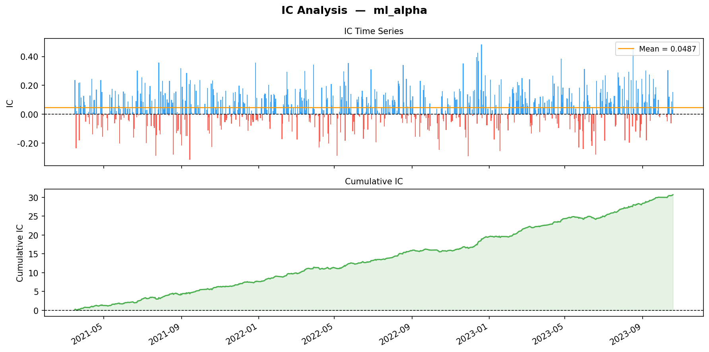
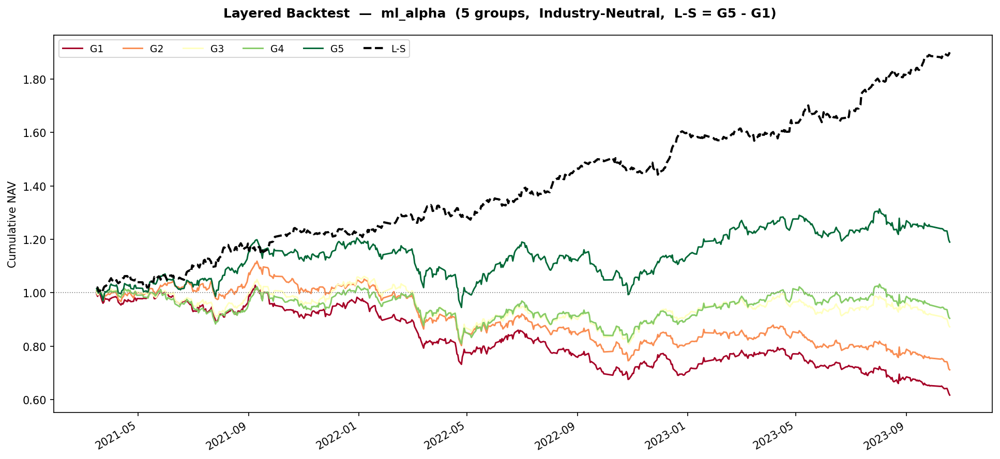
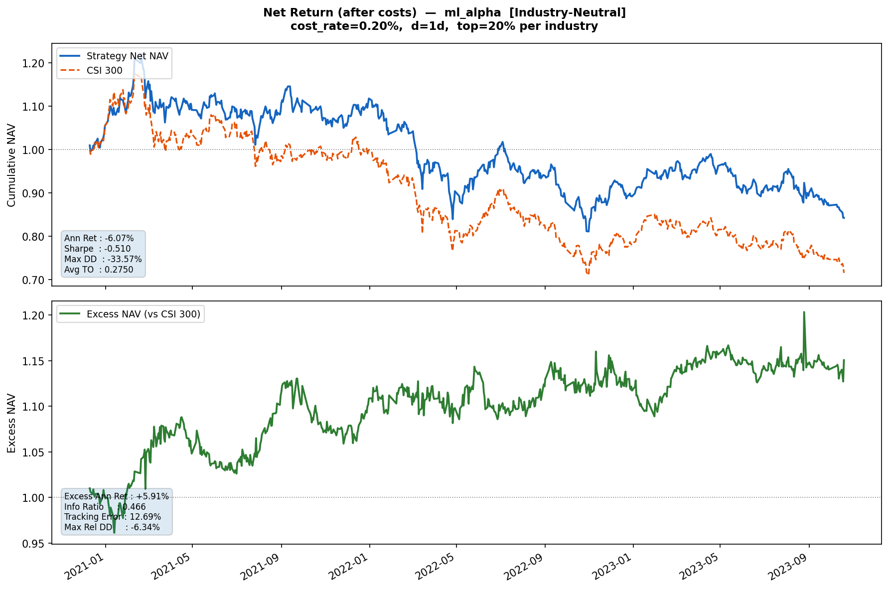
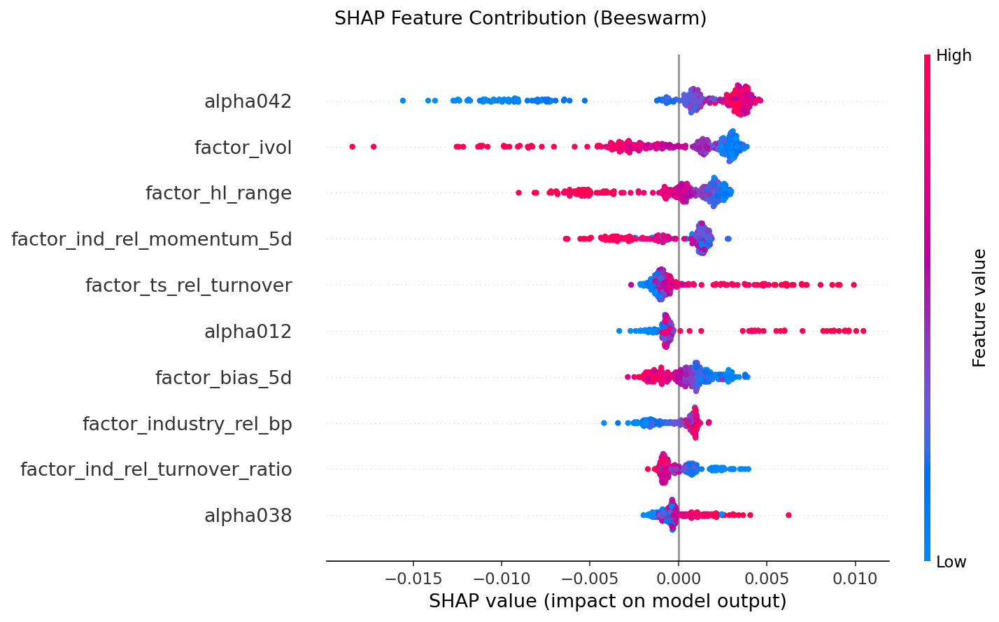
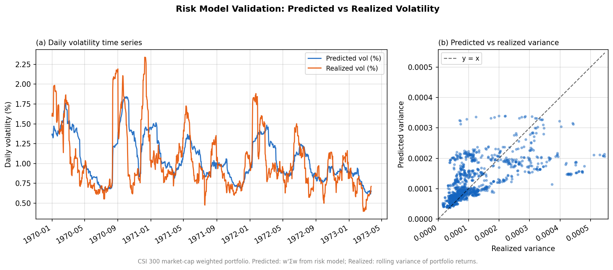
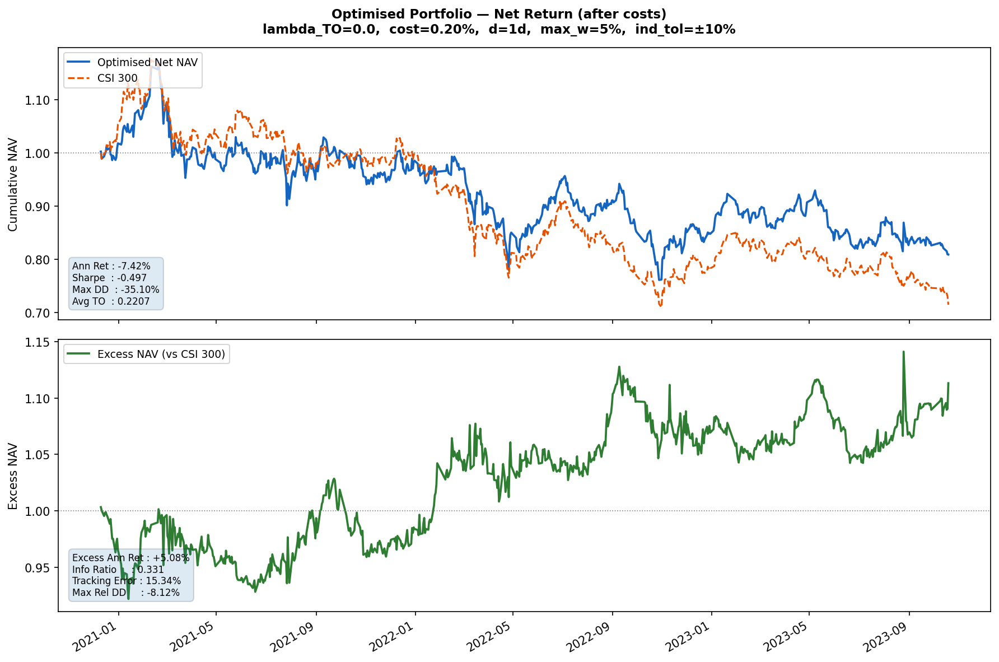

本文档用简明语言说明本仓库中**所有文件与代码的用途、使用方式**，并展示项目架构。

## 一、项目概述

本项目是一个**多因子风险模型与约束组合优化管理**的量化交易示例，分四个阶段实现了数据处理和特征工程、机器学习预测、多因子风险模型构建、组合优化与回测的全流程。其中数据获取、因子计算与清洗、机器学习预测部分采用项目 [Multi-factor-Model-for-Stock-Selection](https://github.com/Parsnip77/Multi-factor-Model-for-Stock-Selection/tree/main) 的框架，多因子风险模型的建模参考华泰证券研报 [“多因子模型体系初探”](./多因子模型体系初探.pdf)。

**第一阶段：数据层（ETL）+ 特征计算 + 特征预处理**

第一阶段用 Tushare Pro 拉取沪深300成分股的日线行情、基本面指标与财务报表信息，写入本地 SQLite 数据库；在此基础上计算了 34 个微观结构与量价因子、7 个基本面与估值因子、12 个横截面相对信息，并加入原始项目中的 15 个因子，进行数据清洗（缺失值以行业中位数填充+时间截面百分位排名处理），实现机器学习预测的特征工程。最终由 `data_preparation_main.py` 串联全流程，将四张对齐的宽表导出为 Parquet 文件。

**第二阶段：ML 合成因子层 + IC 评估 + 初步回测**

第二阶段接入 LightGBM，利用第一阶段获取的特征信息，(15+3n) 个月训练 + 3 个月验证 + 3 个月测试进行拓展窗口时间切分，训练合成一个 ML Alpha，并进行 IC 分析与评估，分组分层回测和 2‰ 交易费用的扣费净收益回测。最终给出 IC 时序图、累计值图、回测收益净值曲线图、指标数据报告、特征重要性参考和 SHAP 分析 beeswarm 图。总脚本由`ml_analyze_main.py`执行，报告写入`result_ml.txt`，图标导出至`\plot`文件夹，因子导出至`ml_alpha.parquet`。

**第三阶段：风险模型构建层 + 风格因子计算**

第三阶段基于第一阶段导出的行情与基本面数据构建多因子风险模型。计算 5 个风格因子（Size、Beta、Momentum、Volatility、Value）与申万一级行业哑变量，截面 winsorize ±3σ 后 z-score 标准化；对每日进行 WLS 截面回归得到因子收益与残差，滚动 60 日估计因子协方差矩阵 $F_t$ 与个股特异性方差 $Δ_{ii}$。最终将因子暴露矩阵、Cholesky 因子 $L_t^\top$、个股特异性标准差 $\sqrt{Δ_{ii}}$ 导出为三个 Parquet 文件，供第四阶段协方差矩阵分解为 SOCP 形式使用。总脚本由 `risk_model_main.py` 执行，输出 `risk_exposure.parquet`、`risk_cov_F.parquet`、`risk_delta.parquet`；可选执行风险模型验证，输出 `plots/risk_model_validation.png` 与 `result_risk_validation.txt`。

**第四阶段：投资组合优化层 + 净收益回测**

第四阶段基于第二阶段生成的 ML Alpha 信号，采用 cvxpy 求解每日行业中性、带换手成本与可选风险惩罚的凸优化问题（LP 或 SOCP），实现投资组合最优化。当 `USE_RISK_MODEL=True` 时，自动加载第三阶段输出的风险模型文件，将协方差矩阵分解为 $\|L_t^\top (X_t^\top w)\|^2 + \|\delta \cdot w\|^2$ 形式进行高效 SOCP 求解。净收益按毛收益减去 2‰ 交易费率与换手率乘积计算，输出净值曲线图和相关回测指标、指数跟踪超额指标。总脚本由 `optimization_main.py` 执行，报告写入 `result_optimization.txt`，净值图导出至 `plots/optimization_nav.png`。

---

项目成果简要展示：

1. 第二阶段合成因子IC分析图、分层回测收益曲线、扣费后净收益曲线和 SHAP beeswarm 图（详细数据指标见 result_ml.txt）









2. 第三阶段风险模型预测效果验证图（详细数据指标见 result_risk_validation.txt）



3. 第四阶段组合优化策略净收益曲线（详细数据指标见 result_optimization.txt）



---

## 二、项目架构

```
项目根目录/
├── data/                                    # 数据存储目录
│   ├── stock_data.db                        # SQLite 数据库（自动生成）
│   ├── prices.parquet                       # 日线行情 + 复权因子 + 可交易标志
│   ├── meta.parquet                         # 每日基本面 + 申万一级行业
│   ├── factors_raw.parquet                  # 原始因子值（保留 NaN）
│   ├── factors_clean.parquet                # 清洗后因子值（百分位排名，不可交易为 NaN）
│   ├── ml_alpha.parquet                     # 第二阶段输出的合成 alpha 信号（ml_analyze_main.py 生成）
│   ├── index.parquet                        # CSI 300 指数每日收盘价（data_preparation_main.py 生成）
│   ├── risk_exposure.parquet                # 每日因子暴露矩阵 X_t（risk_model_main.py 生成）
│   ├── risk_cov_F.parquet                   # Cholesky 因子 L_t^T（F_t = L L^T）
│   └── risk_delta.parquet                   # 个股特异性标准差 sqrt(Δ_{ii})
├── plots/                                   # 图表输出目录
├── src/
│   ├── data_preparation/                    # 第一阶段
│   │   ├── __init__.py
│   │   ├── data_loader.py                   # DataEngine：数据下载与读取
│   │   ├── factors.py                       # FactorEngine：因子计算
│   │   ├── preprocessor.py                  # FactorCleaner：因子清洗
│   │   └── data_preparation_main.py         # 第一阶段总脚本
│   ├── LightGBM/                            # 第二阶段
│   │   ├── __init__.py
│   │   ├── targets.py                       # calc_forward_return：T+d 前向收益率
│   │   ├── ml_data_prep.py                  # WalkForwardSplitter：滚动/扩展窗口 CV
│   │   ├── lgbm_model.py                    # AlphaLGBM：LightGBM 训练/预测/SHAP
│   │   └── ml_analyze_main.py               # 第二阶段总脚本
│   ├── risk_model/                          # 第三阶段
│   │   ├── __init__.py
│   │   ├── risk_factor_engine.py            # RiskFactorEngine：计算 5 风格因子 + 行业哑变量
│   │   ├── cov_estimator.py                 # CovarianceEstimator：WLS 回归 + 滚动协方差估计
│   │   ├── risk_model_validator.py          # RiskModelValidator：预测 vs 已实现波动率验证
│   │   └── risk_model_main.py               # 第三阶段总脚本
│   └── portfolio/                           # 第四阶段
│       ├── __init__.py
│       ├── backtester.py                    # LayeredBacktester：分层回测
│       ├── net_backtester.py                # NetReturnBacktester：净收益回测（含 benchmark 超额收益）
│       ├── ic_analyzer.py                   # IC 评估：calc_ic / calc_ic_metrics / plot_ic
│       ├── optimizer.py                     # PortfolioOptimizer：cvxpy LP 凸优化求解器
│       ├── optimization_backtester.py       # OptimizationBacktester：优化组合回测（含 benchmark 超额收益）
│       └── optimization_main.py             # 第四阶段总脚本
├── .gitignore
├── requirements.txt
├── GUIDE.md
├── PIPELINE.md
├── README.md
├── result_ml.txt
├── result_optimization.txt
├── result_risk_validation.txt
└── Instruction.md
```

---

## 三、各阶段 Pipeline 

详见 [PIPELINE.md](./PIPELINE.md)，其中含有较多数学公式，Github 预览可能不能正常显示，请下载到本地查看。

----

## 四、各文件使用说明

详见 [GUIDE.md](./GUIDE.md)。

---

## 五、推荐使用流程

```bash
# 1. 安装依赖（含 cvxpy）
pip install -r requirements.txt

# 2. 填写 Token（编辑 src/config.py）

# 3. 建库并下载数据
python - <<EOF
import sys
sys.path.insert(0, 'src/data_preparation')
from data_loader import DataEngine
engine = DataEngine()
engine.init_db()
engine.download_data()
EOF

# 4. 运行第一阶段总脚本（因子计算 + 清洗 + 导出 Parquet）
python src/data_preparation/data_preparation_main.py

# 5. 运行第二阶段总脚本（LightGBM 训练 + IC + 回测 + SHAP + 保存 ml_alpha.parquet）
python src/LightGBM/ml_analyze_main.py

# 6. 运行第三阶段总脚本（多因子风险模型）
python src/risk_model/risk_model_main.py
# 输出: data/risk_exposure.parquet, data/risk_cov_F.parquet, data/risk_delta.parquet,
#       plots/risk_model_validation.png, result_risk_validation.txt（RUN_VALIDATION=True 时）

# 7. 运行第四阶段总脚本（凸优化组合回测）
#    在 optimization_main.py 中配置 USE_RISK_MODEL / MU_RISK / MAX_VARIANCE /
#    USE_STYLE_NEUTRAL / SOLVER
python src/portfolio/optimization_main.py
# 输出: result_optimization.txt, plots/optimization_nav.png
```
